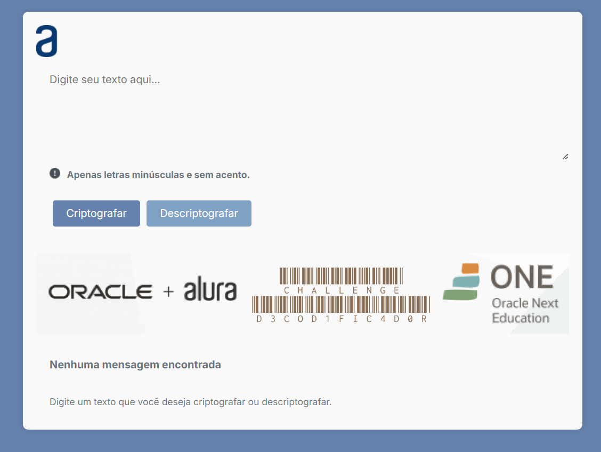

# Tópicos 

- [Descrição do projeto](#descrição-do-projeto)

- [Funcionalidades](#funcionalidades)

- [Aplicação](#aplicação)

- [Ferramentas utilizadas](#ferramentas-utilizadas)

- [Acesso ao projeto](#acesso-ao-projeto)

- [Abrir e rodar o projeto](#abrir-e-rodar-o-projeto)

- [Colaborador](#Colaborador)

# Descrição do projeto 

Projeto Challenge Alura DECODIFICADR DE TEXTO em desenvolvimento conclusão de fase seletiva da Formação Iniciante em Programação T7, dentro do Programa ONE | Oracle Next Generation (2024).

O desafio propõe a criação de um encriptador de texto permite aplicar os conhecimentos teóricos adquiridos nos cursos de lógica de programação em um contexto prático, onde você desenvolverá habilidades na manipulação de dados e na implementação de algoritmos. (Alura Cursos) 

O aplicativo em construção contém um campo para inserção do texto a ser criptografado ou descriptografado e o resultado é exibido na tela. 

# Funcionalidades

`Funcionalidade 1:` Funcionar apenas com letras minúsculas.

`Funcionalidade 2:` Não são utilizadas letras com acentos nem caracteres especiais.

`Funcionalidade 3:` Ccnversão uma palavra para a versão criptografada e também retornar uma palavra criptografada para a versão original (CODEX).

`Funcionalidade 4:` Responsividade em diversas plataformas e dispositivos.

`Funcionalidade EXTRA:` Contém a funcionalidade "ctrl+C" ou "copiar" o texto criptografado/descriptografado para a área de transferência.

# Aplicação

## Criptografar: 

Texto de Entrada: "projeto decodificador"
 

Resultado: "oberlai mufatndober"

## Descriptografar: 

Texto de Entrada: "proberjentertober dentercoberdimesfimescaidoberr"

Resultado: "projeto decodificador"

###

# Ferramentas utilizadas

###

# Acesso ao projeto

Você pode [acessar o código fonte do projeto](https://github.com/jjofilho/projeto_challenge_alura).

# Abrir e rodar o projeto

   <video controls width="500">
      <source src="/assets/RodandoProjetoAlura.mp4" type="video/mp4" />
   </video>

## Colaborador

[  João Oliveira ](https://github.com/jjofilho)
